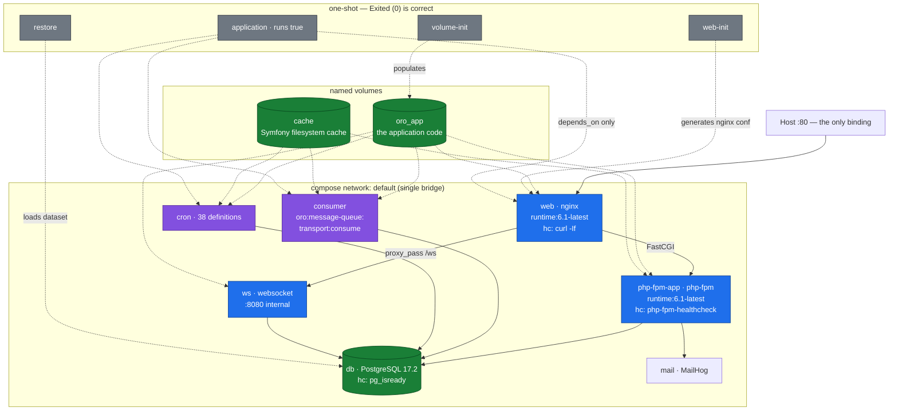

# 02 — Architecture, as observed

**Subject:** OroCommerce **6.1.6 Community Edition**, `oroinc/docker-demo` at commit
`202a279343e62ee99b8cc81f78c307a79958f80d`, running on Linux Mint 22.
**Method:** every statement below is read from the running system or from `docker compose config`
of the checked-out file. Where the vendor documentation says something different, that disagreement
is called out — it is usually the most useful line on the page.

Evidence: `logs/phase5-*`, `logs/phase6-*`, `logs/phase4-validation-table-final-*`.

---

## 1. The version disagreement, first, because it frames everything else

The project targeted 7.0 LTS. It runs 6.1.6, and **that was not a choice about convenience**:

| Claim | Observed |
|---|---|
| `oroinc/docker-demo` has a 7.0 branch | Branches are `5.0 5.1 6.0 master`. No 7.0, no tags at all |
| A 7.0 CE image exists | `oroinc/orocommerce-application` has 5 tags; newest **6.1.6, pushed 2025-12-18**. Never a 7.0 |
| The 7.0 docs describe what you install | The 7.0 page (banner confirmed "7.0 (latest)") instructs a bare `git clone` of that `master` — which pins `ORO_IMAGE_TAG=6.1.6` |

Oro publishes 7.0 documentation over a 6.1 distribution. Setting `ORO_IMAGE_TAG=7.0.x` would
reference an image that has never been published. Confirmed from inside the running container:
`composer.lock` reports `oro/commerce 6.1.6`, `oro/platform 6.1.6`, `oro/customer-portal 6.1.6`, and
**no `oro/commerce-enterprise` package** — CE proven at the package level, not merely inferred from
absent services.

The practical consequence for a reader following the official docs: **the platform requirements on
the 7.0 page do not describe what you get.**

| Component | 7.0 requirements page | Actually running in 6.1.6 |
|---|---|---|
| PHP | ≥ 8.5 | **8.4.14** |
| PostgreSQL | ≥ 17.6 (CE) | **17.2** |
| Node.js | ≥ 24.11.0 | **not present in the runtime image at all** |

Sources: `logs/phase2-remote-refs-*`, `logs/phase2-dockerhub-tags-*`, `logs/phase2-demo-docker-page-*`,
`logs/phase5-oro-package-versions-*`, `logs/phase5-runtime-versions-*`.

---

## 2. Container inventory

Twelve services, **four images**. The image count is the first surprise.

| Service | Image | Command | Ports | Healthcheck | Depends on (condition) | Failure impact |
|---|---|---|---|---|---|---|
| `db` | `oroinc/pgsql:17.2-alpine` | — | none | `pg_isready` (start 60s) | — | **Total.** Data, queue, search index and sessions-adjacent state all live here |
| `php-fpm-app` | `oroinc/runtime:6.1-latest` | `php-fpm` | none | `php-fpm-healthcheck` (5s, start 15s) | `db`(healthy), `mail`(started), `volume-init`(completed) | Total for HTTP. `web` returns 502 |
| `web` | `oroinc/runtime:6.1-latest` | `nginx` | **`80→80` — the only host binding** | `curl -If localhost:80` (15s) | `php-fpm-app`(healthy), `web-init`(completed) | Total for HTTP. Nothing else is reachable from the host |
| `ws` | `oroinc/runtime:6.1-latest` | `websocket` | none (8080 internal) | no | `php-fpm-app`(healthy) | Degraded. Back-office live notifications stop; pages still render |
| `consumer` | `oroinc/runtime:6.1-latest` | `consumer` | none | no | `php-fpm-app`(healthy) | **Silent and severe** — see §5. Nothing errors; work simply accumulates |
| `cron` | `oroinc/runtime:6.1-latest` | `cron` | none | no | `php-fpm-app`(healthy) | Slow decay. 38 definitions stop firing; no immediate symptom |
| `mail` | `mailhog/mailhog` | — | none | no | — | Local only. `php-fpm-app` depends on it *starting*, so a missing `mail` blocks boot |
| `application` | `oroinc/runtime:6.1-latest` | `true` | none | no | `web`,`consumer`,`cron`(started) | None. It is a no-op whose only purpose is its `depends_on` graph |
| `volume-init` | `oroinc/orocommerce-application:6.1.6` | `true` | none | no | — | Boot-blocking. Populates the `oro_app` volume |
| `web-init` | `oroinc/orocommerce-application:6.1.6` | nginx config generation | none | no | `php-fpm-app`(healthy), `ws`(started) | Boot-blocking for `web` |
| `install` | `oroinc/orocommerce-application:6.1.6` | `install` | none | no | `db`(healthy), `mail`(started) | Not used on this path — the alternative to `restore`, never created here |
| `restore` | `oroinc/orocommerce-application-init:6.1.6` | `restore` | none | no | `db`(healthy), `mail`(started), `volume-init`(completed) | One-shot. Loads the pre-built database |

**Four containers showing `Exited (0)` is the correct steady state**: `application`, `volume-init`,
`web-init`, `restore`. A reader who greps for "all containers Up" will misdiagnose a healthy system.
`install` never appears at all on the restore path — it is not a peer of `restore` but its
alternative.

### The image economy — one runtime, six roles

`oroinc/runtime:6.1-latest` (553 MB) backs **six services**: `php-fpm-app`, `web`, `ws`, `consumer`,
`cron`, `application`. The role is selected entirely by `command`. The application *code* is not in
that image — it arrives in the shared `oro_app` volume, populated by `volume-init` from
`orocommerce-application:6.1.6`.

That indirection is the design: **runtime and application are versioned separately**, and the code
is a mounted artefact rather than an image layer. It is why the nginx container can serve PHP
assets, why the consumer can execute the same console binary as php-fpm, and why the runtime image
pins `6.1-latest` (a moving tag) while the application pins `6.1.6` (exact).

| Image | Digest | Size | Serves |
|---|---|---|---|
| `oroinc/orocommerce-application-init:6.1.6` | `sha256:a053d4aa7024…74dd7f6` | 1.25 GB | `restore` |
| `oroinc/orocommerce-application:6.1.6` | `sha256:201f4b6584b2…a53e9c7` | 1.14 GB | `volume-init`, `web-init`, `install` |
| `oroinc/runtime:6.1-latest` | `sha256:95777d7291f3…2db4706` | 553 MB | the six above |
| `oroinc/pgsql:17.2-alpine` | `sha256:c0bf3b44ae0d…c1c6ad0` | 278 MB | `db` |

Total ≈ **3.22 GB**.

### Dependency conditions — the part worth stealing

The graph uses `service_healthy` and `service_completed_successfully`, not `service_started`:

- `php-fpm-app` waits for `db` to pass `pg_isready` **and** for `volume-init` to exit 0
- `web` waits for `php-fpm-app` to pass `php-fpm-healthcheck` **and** `web-init` to exit 0

A Magento compose stack that gates on `service_started` races on cold boot and is usually papered
over with retry loops or a `sleep`. This stack does not need them. The cost is that **only three of
twelve services define a healthcheck** — `db`, `php-fpm-app`, `web`. `consumer`, `cron` and `ws`
have none, which is precisely why consumer failure is silent (§5).

---

## 3. Topology



One `default` bridge network. No segmentation between web tier and data tier — appropriate for a
learning box, and the first thing to change for anything else.

---

## 4. Where cache, search, queue and session actually sit

Read from `php-fpm-app`'s resolved environment:

| Concern | DSN | What it means physically |
|---|---|---|
| Message queue | `ORO_MQ_DSN=dbal:` | **A Postgres table**, `oro_message_queue`. No broker process exists |
| Back-office search | `ORO_SEARCH_ENGINE_DSN=orm:?prefix=oro_search` | Postgres EAV tables |
| Storefront search | `ORO_WEBSITE_SEARCH_ENGINE_DSN=orm:?prefix=oro_website_search` | **A second, separate index**, also Postgres |
| Sessions | `ORO_SESSION_DSN=native:` | PHP's own handler — local filesystem in the `php-fpm-app` container |
| Cache | (no Redis bundle) | Symfony filesystem cache in the **shared `cache` volume** |
| Mail | `ORO_MAILER_DSN=smtp://mail:1025` | MailHog, captured not delivered |
| WebSocket | `ORO_WEBSOCKET_BACKEND_DSN=tcp://ws:8080` | nginx `proxy_pass http://ws/` at `location =/ws` |

Four observations a reviewer should take away:

**Everything asynchronous is PostgreSQL.** Queue, both search indices, and the business data share
one database. `db` is not merely a dependency; it is the single point of contention for the queue
poll loop, the search index writes, and every storefront query simultaneously. In CE this is not a
misconfiguration to fix — it is the edition.

**Two search indices, not one.** `oro_search` (back office) and `oro_website_search` (storefront)
are distinct. Reindexing one does not reindex the other. This has no Magento equivalent — Magento's
storefront and admin search are the same index with different query paths.

**The cache is a shared volume, and that is how CE survives without Redis.** `php-fpm-app`,
`consumer` and `cron` all mount the same `cache` volume at `/var/www/oro/var/cache`. A cache
invalidated by the consumer is therefore visible to php-fpm. It works because every writer is on one
host. It is also the hard blocker on scaling out: a second host would need `oro/redis-config`, which
is EE.

**Sessions are `native:` — local files.** With one `php-fpm-app` container this is invisible. It
makes horizontal scaling of the web tier impossible without changing it first.

**Absent by edition, proven not assumed** (from `compose config --services`, not from an unanswered
port): no Redis, no RabbitMQ, no Elasticsearch. Checks 11–13 report `EXPECTED-ABSENT`.

---

## 5. The async path, measured

Check 7 was run as a controlled experiment rather than a claim.
Evidence: `logs/phase4-check7-queue-roundtrip-*`.

| Step | Observation |
|---|---|
| Baseline, consumer running | `oro_message_queue` depth **0** |
| `docker compose stop consumer` | consumer `exited` |
| Enqueue work (`oro:search:reindex`) with consumer down | depth **1** — the command returned "Reindex finished successfully" |
| Hold 45s, consumer still down | depth **2** — cron added more; **nothing drained** |
| `docker compose start consumer` | depth 2 at t+2s |
| — | depth **0 at t+8s** |

**Drain bound: under 8 seconds** on this hardware for this payload.

Two things this proves that a running-container check cannot:

**The console command lies, benignly.** `oro:search:reindex` printed *"Reindex finished
successfully"* while the consumer was stopped and no reindexing had occurred. It had enqueued the
work, which is all it claims to do. Anyone treating that exit as completion will report success for
an operation that has not started.

**Consumer failure is silent.** No error, no unhealthy container, no failing HTTP check. The
storefront kept returning 200 throughout. The only signal is `oro_message_queue` growing — and
`consumer` has **no healthcheck**, so nothing in the compose stack will tell you. This is why the
project rule is that an Oro install with consumers down is *broken*, not degraded: from the outside
it looks perfect.

The corresponding monitoring rule: **alert on queue depth and message age, not on container state.**

### Consumer process lifecycle

`ps` inside the container shows the container at 28:37 elapsed and the inner console process at
13:19. `job-runner.phar` respawns the consumer on `--time-limit=15minutes` (with
`--memory-limit=1024`). **A consumer process younger than its container is healthy, not a crash** —
the opposite of the intuition an incident responder brings from a long-lived daemon.

---

## 6. The request path

Storefront (`curl -sI http://oro.demo/` → **200**):

```
host :80 → web (nginx) → FastCGI → php-fpm-app → Symfony 6.4.28 (env prod)
                                       ↓
                                 db (PostgreSQL 17.2)
```

Back office (`/admin` → **302** → `/admin/user/login`) is the same path; the 302 to login is the
correct unauthenticated response and is what validation check 3 asserts.

Observed response headers show `Cache-Control: max-age=0, must-revalidate, private` on the
storefront — nothing is HTTP-cacheable by default, and there is **no reverse proxy in this stack at
all**. For a Magento reader this is the conspicuous absence: no Varnish, no built-in FPC tier. Oro's
caching is application-level (Symfony cache in the shared volume) plus a `Link: rel=preload` for
fonts. Full-page caching is not part of the CE demo topology.

`/etc/hosts` maps `oro.demo → 127.0.0.1`, but this is **browser convenience only** — validation
checks 2 and 3 pass without it using `curl -H 'Host: oro.demo' http://127.0.0.1/`, because the
routing that matters happens in nginx's `server_name`, not in host resolution.

---

## 7. What this stack does not tell you

Stated so the document is not read as more complete than it is:

- **No load behaviour.** Everything here is a single-user observation. The `db`-as-SPOF argument in
  §4 is structural, not measured under concurrency.
- **The `install` path was never exercised.** This is the `restore` path only. The install lifecycle
  (schema build, initial reindex, asset build) is unobserved.
- **`UNVERIFIED:` Docker's default address-pool upper bound.** Seven bridge networks pre-existed and
  the eighth was created without incident; the ceiling was never found.
- **No TLS, no reverse proxy, no multi-host.** Out of scope by the spec, and their absence shapes
  §6 — do not read the request path as a production topology.
