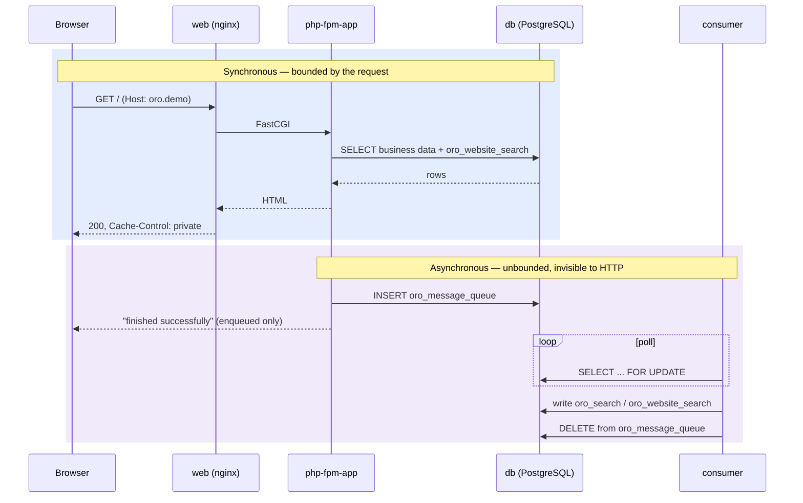

# 03 — Request flow: one synchronous trace, one asynchronous trace

Both traces are annotated with the container at every hop. Everything is observed on
OroCommerce 6.1.6 CE; evidence in `logs/phase6-request-headers-*` and
`logs/phase4-check7-queue-roundtrip-*`.

The point of putting these side by side: **the two paths share only the database.** A request never
waits on the queue, and the queue never knows a request happened. That decoupling is the whole
argument, and it is also why a broken consumer is invisible from the HTTP tier.

---

## 1. Synchronous — a storefront page

`curl -sI http://oro.demo/` → `HTTP/1.1 200 OK`

| # | Hop | Container | Image | What happens |
|---|---|---|---|---|
| 1 | Name resolution | — (host) | — | `oro.demo → 127.0.0.1` from `/etc/hosts`. **Convenience only** — `curl -H 'Host: oro.demo' http://127.0.0.1/` reaches the same place. What matters downstream is the `Host` header, not the resolution |
| 2 | `:80` ingress | `web` | `runtime:6.1-latest` | The only host-published port in the entire stack. nginx matches `server_name` from the `Host` header against config generated at boot by `web-init` |
| 3 | Static vs dynamic split | `web` | same | Assets under `/build/_static/...` are served from the `oro_app` volume by nginx directly — PHP is never entered. Confirmed by the `Link: </build/_static/bundles/orofrontend/...woff2>; rel="preload"` header on the response |
| 4 | FastCGI | `web` → `php-fpm-app` | `runtime:6.1-latest` (both) | Same image, different `command`. nginx does not proxy HTTP here; it speaks FastCGI to the php-fpm pool |
| 5 | Application | `php-fpm-app` | same | Symfony **6.4.28**, `env=prod`, `debug=false`, PHP **8.4.14**. Code is read from the shared `oro_app` volume, not from the image |
| 6 | Cache lookup | `php-fpm-app` | same | Symfony filesystem cache in the `cache` volume. No Redis — `cache:pool:list` shows `cache.app`, `cache.system`, `cache.validator`, `cache.serializer`, `oro.cache.serializer_pool` |
| 7 | Data | `php-fpm-app` → `db` | `pgsql:17.2-alpine` | Business data, and for a search-bearing page the `oro_website_search` EAV tables — the same database, a different prefix |
| 8 | Response | back up the chain | — | `Cache-Control: max-age=0, must-revalidate, private`. **Nothing is HTTP-cacheable.** There is no reverse proxy in the stack |

Back office is the identical path. `/admin` returns `302 → /admin/user/login` when
unauthenticated, with `Cache-Control: ...no-cache, no-store, private` — stricter than the
storefront, which is what you would expect and what validation check 3 asserts.

### The WebSocket branch

nginx carries a third destination that is neither static nor FastCGI:

```
location =/ws  →  proxy_pass http://ws/     (ws container, :8080 internal)
```

Observed in the generated config at `/opt/oro-nginx/etc/sites-available/*.conf:166-168`. The `ws`
container is a Ratchet-style long-lived PHP process, `ORO_WEBSOCKET_BACKEND_DSN=tcp://ws:8080`.
It backs back-office live notifications. **`ws` has no healthcheck**, and its failure mode is a
back office that renders perfectly but never updates — no error anywhere.

### What is conspicuously not in this path

For a Magento-background reader, the absences are more informative than the hops:

- **No Varnish, no FPC tier, no reverse proxy of any kind.** Oro's caching here is application-level
  only. This is a demo topology, not an argument that Oro doesn't want a proxy — but it means every
  storefront hit executes PHP.
- **No Node.js in the runtime image.** Assets are built into `orocommerce-application:6.1.6` and
  arrive via the `oro_app` volume. There is no runtime asset compilation step, and no toolchain to
  run one with. `bin/console` also lives at `/var/www/oro/bin/console` — the container WORKDIR is
  `/`, so a relative `bin/console` fails.

---

## 2. Asynchronous — a reindex

This trace is measured, not described. The experiment (§5 of `02-architecture.md`) stopped the
consumer, enqueued work, held, then restarted.

| # | Hop | Container | What happens | Observed |
|---|---|---|---|---|
| 1 | Trigger | `php-fpm-app` | `oro:search:reindex` — or, in normal operation, an entity change in the back office | — |
| 2 | Enqueue | `php-fpm-app` → `db` | `ORO_MQ_DSN=dbal:` — the "broker" is an `INSERT` into `oro_message_queue` | depth `0 → 1` |
| 3 | **Return to caller** | `php-fpm-app` | The command prints **"Reindex finished successfully"** and exits 0 | — |
| 4 | Poll | `consumer` → `db` | `oro:message-queue:transport:consume oro.default` — a `SELECT`/lock loop against the same table | — |
| 5 | Process | `consumer` | Writes the `oro_website_search` / `oro_search` EAV tables | — |
| 6 | Ack | `consumer` → `db` | `DELETE` from `oro_message_queue` | depth → `0` |
| 7 | Visible | storefront | The next request reads the updated index | — |

### Measured timings

| Condition | Depth | Elapsed |
|---|---|---|
| Consumer running, idle | 0 | baseline |
| Consumer **stopped**, work enqueued | 1 | immediate |
| Consumer **stopped**, held | **2** (cron added more) | +45s — **nothing drained** |
| Consumer started | 2 | t+2s |
| Consumer running | **0** | **t+8s — drained** |

**Bound: under 8 seconds** for this payload on this hardware.

### Step 3 is the one that matters

`oro:search:reindex` reported **"Reindex finished successfully"** while the consumer was stopped and
no reindexing had happened or could happen. The command is not lying — enqueuing *is* its job — but
its exit code and its message describe the enqueue, not the work.

Anyone wiring that command into a deployment script, a smoke test, or a CI gate will get a green
result for an operation that has not started. The honest assertion is not the command's exit code;
it is **`oro_message_queue` returning to its prior depth**.

### Why nothing alerts

Through the entire stalled window:

- storefront kept returning `200`
- `docker compose ps` showed every long-running service healthy or running
- the three healthchecks (`db`, `php-fpm-app`, `web`) all passed
- `consumer` has **no healthcheck at all** — nor do `cron` and `ws`

The stack cannot report this failure. **Alert on queue depth and oldest-message age, not on
container liveness.** A container-state dashboard would have shown all green for as long as the
consumer stayed down.

### Consumer lifecycle, so `ps` is not misread

Inside the container: PID 7 is `job-runner.phar` at 28:37 elapsed; PID 109 is the actual console
process at 13:19. The runner respawns the consumer on `--time-limit=15minutes`
(`--memory-limit=1024`).

**A consumer process younger than its container is the healthy case.** The design assumes the PHP
process is recycled to bound memory. An incident responder who reads a short-lived worker as
"crash-looping" will chase the wrong thing.

---

## 3. The two paths, together



The paths meet only at `db`. That is the design's strength — a slow reindex cannot stall a page
render — and its operational trap: the synchronous path stays green while the asynchronous path is
dead, and **only a queue-depth metric distinguishes the two.**
